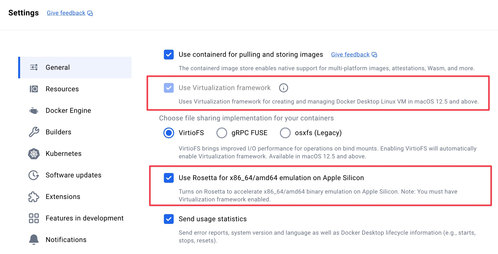

# SingleStore Dev Image <!-- omit in toc -->
[](https://github.com/singlestore-labs/singlestoredb-dev-image/actions)

The SingleStore Dev Image is the fastest way to develop with [SingleStore][singlestore] on your laptop or in a CI/CD environment (including [GitHub Actions][header-gh-actions]). This Docker image is **not supported for production workloads or benchmarks** so please keep this in mind when using it.

If you have any questions or issues, please file an issue on the [GitHub repo][gh-issues] or our [forums].

[header-gh-actions]: #how-to-run-singlestore-in-github-actions

- [How to run the Docker image?](#how-to-run-the-docker-image)
  - [How to run the Docker image on **Linux** or **Apple Intel**?](#how-to-run-the-docker-image-on-linux-or-apple-intel)
  - [How to run the Docker image on **Apple silicon**?](#how-to-run-the-docker-image-on-apple-silicon)
  - [How to run the Docker image on **Windows**?](#how-to-run-the-docker-image-on-windows)
- [How to open a SQL shell?](#how-to-open-a-sql-shell)
- [How to access the Studio UI?](#how-to-access-the-studio-ui)
- [Where can I learn how to use SingleStore?](#where-can-i-learn-how-to-use-singlestore)
- [How to access the Data API?](#how-to-access-the-data-api)
- [How to use WebAssembly (Wasm) backed functions?](#how-to-use-webassembly-wasm-backed-functions)
- [How to use Docker volumes for persistent storage?](#how-to-use-docker-volumes-for-persistent-storage)
- [How to initialize this container with a SQL file?](#how-to-initialize-this-container-with-a-sql-file)
- [How to set SingleStore global variables?](#how-to-set-singlestore-global-variables)
- [How to use a specific SingleStore version?](#how-to-use-a-specific-singlestore-version)
  - [Which SingleStore versions are available?](#which-singlestore-versions-are-available)
  - [How to build a custom version of this Docker image with a specific SingleStore version?](#how-to-build-a-custom-version-of-this-docker-image-with-a-specific-singlestore-version)
  - [How to specify a SingleStore version at runtime?](#how-to-specify-a-singlestore-version-at-runtime)
- [How to use this container in a CI/CD environment?](#how-to-use-this-container-in-a-cicd-environment)
  - [How to run SingleStore in GitHub Actions?](#how-to-run-singlestore-in-github-actions)
  - [How to run SingleStore in GitLab CI/CD?](#how-to-run-singlestore-in-gitlab-cicd)
- [How to upgrade from singlestore/cluster-in-a-box?](#how-to-upgrade-from-singlestorecluster-in-a-box)
- [Apple silicon performance notes](#apple-silicon-performance-notes)

## How to run the Docker image?

This Docker image allows a cluster to be deployed in a self-contained container without the need for a license.

When running a Docker container on a machine with:

* More than 32 cores, include the `--cpus=32` option.
* More than 128GB of RAM, include the `--memory=128g` option.

> **Note:**
> SingleStore recommends using an explicit image version tag whenever possible from the [list of image tags][versions] and/or [the changelog][changelog].

### How to run the Docker image on **Linux** or **Apple Intel**?

*See next section for Apple silicon instructions.*

```bash
docker run \
    -d --name singlestoredb-dev \
    -e ROOT_PASSWORD="YOUR SINGLESTORE ROOT PASSWORD" \
    -p 3306:3306 -p 8080:8080 -p 9000:9000 \
    ghcr.io/singlestore-labs/singlestoredb-dev:latest
```

If you want to configure a specific license, simply pass it as an environment variable:

```bash
docker run \
    -d --name singlestoredb-dev \
    -e ROOT_PASSWORD="YOUR SINGLESTORE ROOT PASSWORD" \
    -e SINGLESTORE_LICENSE="YOUR SINGLESTORE LICENSE" \
    -p 3306:3306 -p 8080:8080 -p 9000:9000 \
    ghcr.io/singlestore-labs/singlestoredb-dev:latest
```

If you want to use Kai (API for MongoDB clients), set `ENABLE_KAI=1` and expose port 27017:

```bash
docker run \
    -d --name singlestoredb-dev \
    -e ROOT_PASSWORD="YOUR SINGLESTORE ROOT PASSWORD" \
    -e ENABLE_KAI=1 \
    -p 3306:3306 -p 8080:8080 -p 9000:9000 -p 27017:27017 \
    ghcr.io/singlestore-labs/singlestoredb-dev:latest
```

Then connect with, for example:

```bash
mongosh "mongodb://root:YOUR SINGLESTORE ROOT PASSWORD@localhost:27017/?authMechanism=PLAIN&loadBalanced=true"
```

### How to run the Docker image on **Apple silicon**?

> **Note**
>
> The latest SingleStore Dev Image uses AlmaLinux 10 as the base OS, which relies on the x86‑64‑v3 instruction set. This version should work as expected on:
>
> * Apple silicon Macs running macOS 26
> * Intel Macs running macOS 15 (Sequoia) and macOS 26 (Tahoe)
> 
> The version of Rosetta on Apple silicon Macs running macOS 15 does not support the x86‑64‑v3 instruction set. When attempting to run the latest SingleStore Dev Image on these Macs, a `Fatal glibc error: CPU does not support x86-64-v3` message is displayed.
>
> To remedy this, either:
> * Upgrade your Apple silicon Mac to [macOS 26](https://www.apple.com/os/macos/)
> * Use [SingleStore Helios](https://www.singlestore.com/pricing/) for development

First, make sure you are using Docker Desktop which supports the latest virtualization technology on Apple silicon.

Second, **you must enable "Use Virtualization framework" and "Use Rosetta for x86_64/amd64 emulation on Apple Silicon" in Docker Desktop preferences**. If you do not do this, SingleStore will run very slowly and consume a lot of power on your Mac. You can find these settings under Docker Desktop > Preferences > General.



Third, run the following command to start SingleStore. Note the `--platform linux/amd64` instruction which is required when running on Apple silicon.

```bash
docker run \
    -d --name singlestoredb-dev \
    -e ROOT_PASSWORD="YOUR SINGLESTORE ROOT PASSWORD" \
    --platform linux/amd64 \
    -p 3306:3306 -p 8080:8080 -p 9000:9000 \
    ghcr.io/singlestore-labs/singlestoredb-dev:latest
```

### How to run the Docker image on **Windows**?

Windows PowerShell and Command Prompt (CMD) work best if you run the command on a single line. Alternatively you can use backticks for multi-line strings in PowerShell. Either way, the following single-line version of the command will work on Windows.

```bash
docker run -d --name singlestoredb-dev -e ROOT_PASSWORD="YOUR SINGLESTORE ROOT PASSWORD" -p 3306:3306 -p 8080:8080 -p 9000:9000 ghcr.io/singlestore-labs/singlestoredb-dev:latest
```

## How to open a SQL shell?

This image includes a shell which you can run interactively using `docker exec`.

The following command will prompt you for the root password. 

```bash
docker exec -it singlestoredb-dev singlestore -p
```

You can also provide the root password at the command line immediately after the `-p` flag like so:

```bash
docker exec -it singlestoredb-dev singlestore -pYOUR_ROOT_PASSWORD
```

You can also connect to SingleStore using any MySQL compatible client on your own machine using the following connection details:

| Key      | Value              |
| -------- | ------------------ |
| Host     | `127.0.0.1`          |
| Port     | `3306`               |
| Username | `root`               |
| Password | YOUR_ROOT_PASSWORD |

## How to access the Studio UI?

The Studio UI is a convenient way to connect to SingleStore and run queries via a browser-based UI. The UI runs by default on port 8080 in the container. Assuming that you have forwarded port 8080 to your local machine, you can access the UI at [http://localhost:8080](http://localhost:8080).

You will see a login screen when you open the UI. Use the username `root` and the associated password you set when starting the container.

## Where can I learn how to use SingleStore?

Now that you have SingleStore running, please check out the following sections of our official documentation for guides on what to do next.

 * [Connect to SingleStore](https://docs.singlestore.com/db/latest/connect-to-singlestore/)
 * [Developer Resources](https://docs.singlestore.com/db/latest/developer-resources/)
 * [Integrations](https://docs.singlestore.com/db/latest/integrate-with-singlestore/)
 * [Load Data](https://docs.singlestore.com/db/latest/load-data/)

## How to access the Data API?

In addition to supporting the MySQL protocol, SingleStore also has a JSON over HTTP protocol called the [Data API][data-api] which you can access at port 9000 in the container. Assuming that you have forwarded port 9000 to your local machine, the following `curl` command demonstrates how you can use the Data API:

```bash
~ ➜ curl -s -XPOST -H "content-type: application/json" -d '{ "sql": "select 1" }' root:YOUR_ROOT_PASSWORD@localhost:9000/api/v1/query/rows
{
  "results": [
    {
      "rows": [
        {
          "1": 1
        }
      ]
    }
  ]
}
```

> **Note**
> For more information on how to use the Data API please [visit the documentation.][data-api]

## How to use WebAssembly (Wasm) backed functions?

The Code Engine feature in SingleStore supports creating functions (UDFs and
TVFs) using code compiled to WebAssembly (Wasm). This feature supports any
language that can compile to the Wasm core specification, which allows you to
create UDFs in a language of your choice using existing code libraries and run
them in a sandboxed environment for enhanced security. It uses a linear memory
model and provides hard memory protection boundaries.

This Docker image has Wasm functions enabled by default. You can learn how to compile and load Wasm UDFs and UDAs into SingleStore [in our docs][wasm].

## How to use Docker volumes for persistent storage?

> **Note**
> If you are [specifying a Singlestore version at runtime](#how-to-specify-a-singlestore-version-at-runtime), your data will always be overwritten when the container restarts each time, as the container will always attempt to re-download and re-initialize the installed version on each run.
>
> To get around this, build a [custom image](#how-to-build-a-custom-version-of-this-docker-image-with-a-specific-singlestore-version) with your specific version.

```bash
docker run \
    -d --name singlestoredb-dev \
    -e ROOT_PASSWORD="YOUR ROOT PASSWORD" \
    -p 3306:3306 -p 8080:8080 -p 9000:9000 \
    -v my_cool_volume:/data \
    ghcr.io/singlestore-labs/singlestoredb-dev
```

After creating the container with a volume, you can re-create the container using the same volume to keep your data around. This can be used to upgrade SingleStore to new versions without losing your data. Keep in mind that SingleStore does **not** support downgrading. Make sure to take a backup of the volume before running the upgrade.

> **Note**
> In order to mount a host volume to the `/data` directory, you will need to `chown` the volume to `UID=999` and `GID=998` before mounting it. The volume will be initialized automatically if empty. Host volumes are only supported by the `/data` directory.

This Docker image has a number of volume mount points in addition to `/data`. The following table outlines each of the mount points along with roughly their contents:

| mount path | description                                                                                                        |
| ---------- | ------------------------------------------------------------------------------------------------------------------ |
| /data      | All of the data, config, and cache for the SingleStore cluster.                                                    |
| /logs      | All of the tracelog files containing information that can help debug the cluster or observe its current behavior.  |
| /server    | The installation directory containing server binaries and other installation state.                                |

## How to initialize this container with a SQL file?

When this Docker image starts for the first time, it checks to see if an `init.sql` file exists in its filesystem. The default location is `/init.sh`, but it can be customized via the `INIT_SQL` environment variable. If `init.sql` is found, the container will run it against the database as soon as SingleStore is ready.

One way to do this is by mounting an `init.sql` from your machine into the container using the `-v` flag. Here is an example of doing this:

```bash
docker run \
    -d --name singlestoredb-dev \
    -e ROOT_PASSWORD="YOUR ROOT PASSWORD" \
    -p 3306:3306 -p 8080:8080 -p 9000:9000 \
    -v ${PWD}/test/init.sql:/init.sql \
    ghcr.io/singlestore-labs/singlestoredb-dev
```

Replace `${PWD}/test/init.sql` with an absolute path to the SQL file with which to initialize SingleStore.

> **Note**
> `/init.sql` will only be run once. If you want to run it again you will need to delete the file `/data/.init.sql.done` and then restart the container.

## How to set SingleStore global variables?

SingleStore can be configured through the use of global variables which you can [find in our documentation][global-vars]. These variables can be set using environment variables when running the SingleStore Dev Image using the prefix `SINGLESTORE_SET_GLOBAL_`.

For example, if you want to set `default_partitions_per_leaf` to `1`, you would do this:

```bash
docker run \
    -d --name singlestoredb-dev \
    -e ROOT_PASSWORD="YOUR ROOT PASSWORD" \
    -e SINGLESTORE_SET_GLOBAL_DEFAULT_PARTITIONS_PER_LEAF=1 \
    -p 3306:3306 -p 8080:8080 -p 9000:9000 \
    ghcr.io/singlestore-labs/singlestoredb-dev
```

Multiple environment variables can be specified if you want to configure multiple global variables in SingleStore.

If you specify a variable which is not supported by SingleStore, the image will fail to start. You can see the full error message by inspecting the failed Docker container's logs using `docker log`.

## How to use a specific SingleStore version?

By default, the SingleStore Dev Image uses the latest version of SingleStore available. If you would prefer to use another SingleStore version, you will need to either build a custom version of this image or specify the version at runtime by following the tutorials below.

### Which SingleStore versions are available?

You can use the version numbers in the first column of the following table in order to run a specific version of SingleStore. If you want to use a particular patch version, just specify that version instead.

| `SINGLESTORE_VERSION`                    | description                                                      |                                                                                                                                              |
| ---------------------------------------- | ---------------------------------------------------------------- | -------------------------------------------------------------------------------------------------------------------------------------------- |
| 9.0                                      | SingleStore Self-Managed 9.0, see release log for latest version | [changelog](https://docs.singlestore.com/db/v9.0/release-notes/singlestore-memsql/9-0-release-notes/) |
| 8.9                                      | SingleStore Self-Managed 8.9, see changelog for latest version | [changelog](https://docs.singlestore.com/db/v8.9/release-notes/singlestore-memsql/8-9-release-notes/maintenance-release-changelog-v-8-9/) |
| 8.7                                      | SingleStore Self-Managed 8.7, see changelog for latest version | [changelog](https://docs.singlestore.com/db/v8.7/release-notes/singlestore-memsql/8-7-release-notes/maintenance-release-changelog-v-8-7/) |
| 8.5                                      | SingleStore Self-Managed 8.5, see changelog for latest version | [changelog](https://docs.singlestore.com/db/v8.5/release-notes/singlestore-memsql/8-5-release-notes/maintenance-release-changelog-v-8-5/) |
| 8.1                                      | SingleStore Self-Managed 8.1, see changelog for latest version | [changelog](https://docs.singlestore.com/db/v8.1/release-notes/singlestore-memsql/8-1-release-notes/maintenance-release-changelog/) |
| 8.0                                      | SingleStore Self-Managed 8.0, see changelog for latest version | [changelog](https://docs.singlestore.com/db/v8.0/release-notes/singlestore-memsql/8-0-release-notes/maintenance-release-changelog/) |
| 7.8                                      | SingleStore Self-Managed 7.8, see changelog for latest version | [changelog](https://docs.singlestore.com/db/v7.8/release-notes/singlestore-memsql/7-8-release-notes/maintenance-release-changelog/) |
| 7.6                                      | SingleStore Self-Managed 7.6, see changelog for latest version | [changelog](https://docs.singlestore.com/db/v7.6/release-notes/singlestore-memsql/7-6-release-notes/maintenance-release-changelog/) |

### How to build a custom version of this Docker image with a specific SingleStore version?

The script `/scripts/switch-version.sh` can be used to easily build a custom version of this image. The fastest way to do this is using Docker build like so:

```bash
cat <<EOF | docker build -f - -t singlestoredb-dev:custom .
FROM ghcr.io/singlestore-labs/singlestoredb-dev
RUN /scripts/switch-version.sh SINGLESTORE_VERSION SINGLESTORE_LICENSE
EOF
```

Make sure to replace `SINGLESTORE_VERSION` and `SINGLESTORE_LICENSE` with the SingleStore version you want to use (see table above) as well as your license key. After running this command, you will have a new Docker image called `singlestoredb-dev:custom` with the specific version of SingleStore installed and ready to use.

### How to specify a SingleStore version at runtime?

In order to use a specific version of SingleStore at runtime, you can start the Docker container with the `SINGLESTORE_VERSION` environment variable set.

> **Warning**
> This method will result in the container taking much longer to start (roughly a minute) because it has to download and install SingleStore each time. For this reason, SingleStore recommends building a custom version of this Docker image using [the instructions above][custom image method].

Here is an example of using the `SINGLESTORE_VERSION` environment variable to run SingleStore 9.0:

```bash
docker run \
    -d --name singlestoredb-dev \
    -e ROOT_PASSWORD="YOUR ROOT PASSWORD" \
    -e SINGLESTORE_VERSION="9.0" \
    -p 3306:3306 -p 8080:8080 -p 9000:9000 \
    ghcr.io/singlestore-labs/singlestoredb-dev
```

> **Note**
> You can mount `/server` into a Docker volume to preserve the installed SingleStore server binaries if you are unable to use the [custom image method]. This will increase subsequent startup performance at the expense of complexity.

[custom image method]: #how-to-build-a-custom-version-of-this-docker-image-with-a-specific-singlestore-version

## How to use this container in a CI/CD environment?

This Docker image defines a healthcheck which runs every 5 seconds. Any CI/CD system or container runtime which respects the healthcheck should automatically wait for SingleStore to be running and healthy.

### How to run SingleStore in GitHub Actions?

Here is an example workflow which runs SingleStore as a container service and queries it from the job.

```yaml
name: my-workflow
on: push

jobs:
  my-job:
    runs-on: ubuntu-latest
    needs: build-image

    services:
      singlestoredb:
        image: ghcr.io/singlestore-labs/singlestoredb-dev
        ports:
          - 3306:3306
          - 8080:8080
          - 9000:9000
        env:
          ROOT_PASSWORD: test
          # Optional:
          # SINGLESTORE_LICENSE: ${{ secrets.SINGLESTORE_LICENSE }}

    steps:
      - name: sanity check using mysql client
        run: |
          mysql -u root -ptest -e "SELECT 1" -h 127.0.0.1
```

### How to run SingleStore in GitLab CI/CD?

Here is an example workflow which runs SingleStore as a service and queries it from the job. Unfortunately GitLab does not support Docker healthchecks for services, so additional logic must be added to wait for SingleStore to be ready. There is a [closed issue](https://gitlab.com/gitlab-org/gitlab-runner/-/issues/3984) to address this problem in GitLab.

> **Note**
> You can add your SingleStore license key to GitLab secrets under the key `SINGLESTORE_LICENSE`.

```yaml
image: debian

stages:
  - test

variables:
    ROOT_PASSWORD: test
    # Optional:
    # SINGLESTORE_LICENSE: $SINGLESTORE_LICENSE

testing:
  stage: test
  services:
    - name: ghcr.io/singlestore-labs/singlestoredb-dev:latest
      alias: singlestoredb-dev
  script:
    - apt update
    - apt install -y mariadb-client curl
    - curl -sI localhost:8080 --retry 30 --retry-connrefused --retry-delay 1
    - mysql -u root -ptest -h singlestoredb-dev -e "create database foo"
    - mysql -u root -ptest -h singlestoredb-dev -e "create table foo.bar (id int)"
    - mysql -u root -ptest -h singlestoredb-dev -e "insert into foo.bar values (1),(2),(3)"
    - mysql -u root -ptest -h singlestoredb-dev -e "select * from foo.bar"
```

## How to upgrade from `singlestore/cluster-in-a-box`?

Before this image was created, there was another Docker image called `singlestore/cluster-in-a-box (CIAB)`. The `docker run` command for the CIAB image looked something like this:

```bash
docker run -i --init \
    --name singlestore-ciab \
    -e LICENSE_KEY=${LICENSE_KEY} \
    -e ROOT_PASSWORD=${ROOT_PASSWORD} \
    -p 3306:3306 -p 8080:8080 \
    singlestore/cluster-in-a-box
```

The differences between the CIAB image and the Dev image are the following:

 * The Dev image no longer needs to be initialized before you can use it
 * Startup time is much better - roughly 5 seconds with the Dev image versus a minute with the CIAB image
 * The [Data API][data-api] and External Functions features are enabled by default in the Dev image
 * Upgrade between versions is supported and tested with the Dev image (downgrades are not supported)
 * The Dev image is distributed through the GitHub Container Repository rather than the Docker Hub

SingleStore recommends using the Dev image unless you need to run earlier versions of SingleStore that have not been released as a `singlestoredb-dev-image`.

## Apple silicon performance notes

Many of SingleStore's performance optimizations are disabled in order to support running on Apple silicon. This can result in unexpectedly poor performance, especially during recovery (restarting SingleStore) and when running queries for the first time.

To tune this performance impact to be either faster or slower, you can change the number of cores and amount of RAM allocated to the Docker virtual machine by [following the documentation here][docker-resource-docs].

[versions]: https://github.com/singlestore-labs/singlestoredb-dev-image/pkgs/container/singlestoredb-dev/versions
[changelog]: CHANGELOG.md
[try-free]: https://www.singlestore.com/try-free/
[singlestore]: https://www.singlestore.com/
[gh-issues]: https://github.com/singlestore-labs/singlestoredb-dev-image/issues
[forums]: https://www.singlestore.com/forum/
[portal]: https://portal.singlestore.com/
[data-api]: https://docs.singlestore.com/cloud/reference/data-api/
[docker-resource-docs]: https://docs.docker.com/desktop/settings/mac/#advanced
[global-vars]: https://docs.singlestore.com/db/latest/reference/configuration-reference/engine-variables/
[wasm]: https://docs.singlestore.com/db/latest/reference/code-engine-powered-by-wasm/
